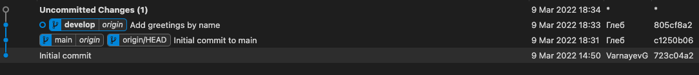
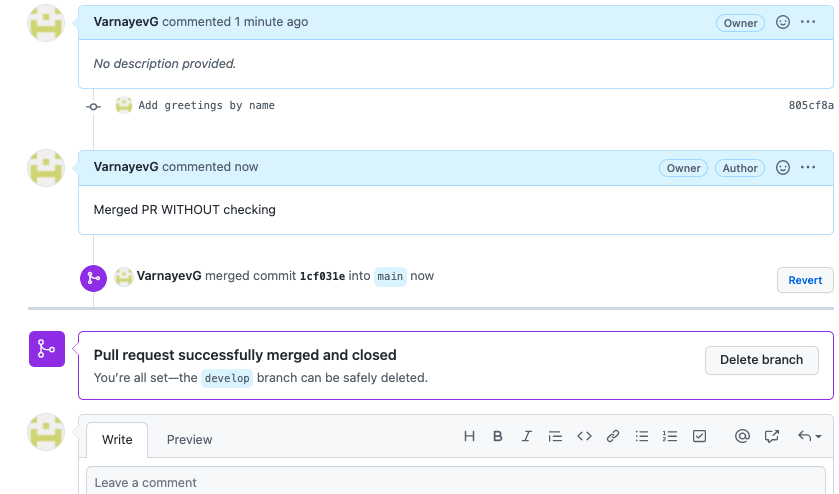
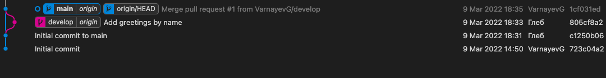
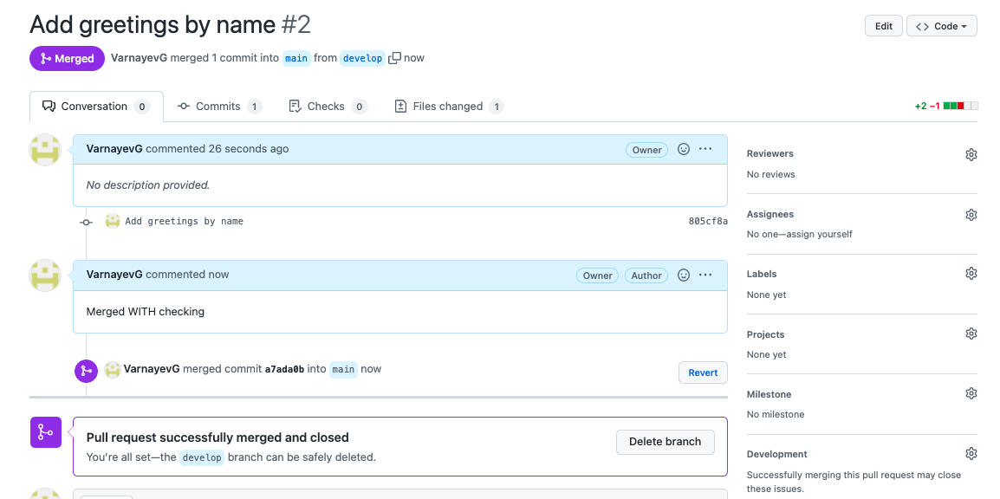

First of all, make initial commit to main, then create develop branch from it and commit there.

After that, we want to create PR to main, however pr checking doesn't occur:

To set PR back, we do the following
1. git checkout main
2. git reset HEAD^
3. Unstaged changes in main.py appear, discard them
4. git push -f origin main:main

Than we create another PR, check it, approve and merge

